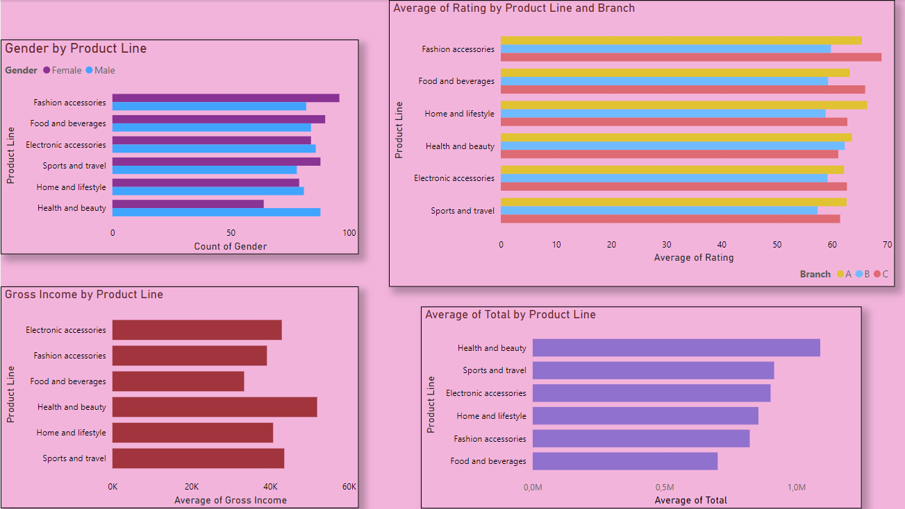

# MARKET DATA SET

[](https://www.yandex.com.tr/gorsel/search?from=tabbar&img_url=https%3A%2F%2Fdatafloq.com%2Fwp-content%2Fuploads%2F2021%2F12%2Fblog_pictures2Fdata-driven-marketing-2017-marketers-data-critical.jpg&lr=104782&pos=1&rpt=simage&text=market%20data)

This data set is taken from [Kaggle](https://www.kaggle.com/datasets/arunjangir245/super-market-sales)

## Power BI

{width="702"}

This graph is made by POWER BI.

## Preperation

```{r echo = T, results = 'hide',message=FALSE, warning=FALSE}
# Please first download required library
library(tidyverse)
library(ggplot2)
library(dplyr)
library(rvest)
library(stringr)
library(corrplot)

```

## 

## General Information About Data Set

```{r}
data<-read.csv("C:/Users/gozde/Desktop/market/supermarket_sales.csv")
# Assuming 'data' is your data frame
cols_to_factor <- c("Gender", "Customer.type", "City", "Branch", "Product.line", "Payment")

# Use lapply to factorize selected columns
data[cols_to_factor] <- lapply(data[cols_to_factor], factor)

# View the summary
summary(data)


```

Features:

1.  Invoice ID: Unique identifier for each invoice.

2.  Branch: The branch where the purchase was made.

3.  City: The city where the purchase was made.

4.  Customer Type: Type of customer, e.g., "Member" or "Normal."

5.  Gender: Gender of the customer.

6.  Product Line: The category or type of product.

7.  Unit Price: Price per unit of the product.

8.  Quantity: Number of units purchased.

9.  Tax 5%: Tax amount as a percentage of the total.

10. Total: Total amount including tax.

## Plot of Market Sales Data

### Gender vs Product Line

```{r fig.dim = c(10, 8)}
ggplot(data = data, aes(x=Product.line, fill = Gender)) +
  geom_histogram(stat="count",position="dodge")+theme_minimal()+
  xlab("Product Line")+ylab("Gender")+labs(title="Product Line vs Gender")

```

As we can see from the plot, the Majority of Females tend to buy Fashion accessories. But Males tend to buy health and beauty stuff.

### Average Rating vs Product Line

```{r fig.dim = c(10, 8)}
average_ratings <- data %>%
  group_by(Product.line) %>%
  summarize(Average_Rating = mean(Rating, na.rm = TRUE))


# Create a bar plot using ggplot2 with average rating on the y-axis
ggplot(data = average_ratings, aes(x = Product.line, y = Average_Rating, fill = Product.line)) +
  geom_bar(stat = "identity", position = "dodge") +
  theme_minimal() +
  xlab("Product Line") +
  ylab("Average Rating") +
  labs(title = "Product Line vs Average Rating")
```

Food and beverages are mostly likeable.

### Average Income vs Branch

```{r fig.dim = c(10, 8)}
average_income=data %>% group_by(Branch) %>% 
  summarize(average=mean(gross.income))

ggplot(data = average_income, aes(y = average ,x=Branch, fill = Branch)) +
  geom_bar(stat = "identity", position = "dodge") +
  theme_minimal() +
  xlab("Branch") +
  ylab("Average Income") +
  labs(title = "Average Income vs Branch")

```

The branch C is makes the most income other than the Branch A and B.

### Quantity vs Branch

```{r fig.dim = c(10, 8)}
average_quantity=data %>% group_by(Branch) %>% 
  summarize(average=mean(Quantity))

ggplot(data = average_quantity, aes(y = average ,x=Branch, fill = Branch)) +
  geom_bar(stat = "identity", position = "dodge") +
  theme_minimal() +
  xlab("Branch") +
  ylab("Quantity") +
  labs(title = "Quantity vs Branch")
```

### Customer Type vs Gender

```{r fig.dim = c(10, 8)}
ggplot(data = data, aes(x = Customer.type, fill = Gender)) +
  geom_bar() +
  theme_minimal() +
  xlab("Customer Type") +
  ylab("Count") +
  labs(title = "Customer Type vs Gender")
```

Females are more tend to be members. But, Males are more tend to be Normal customers.

### Gender vs Payment

```{r fig.dim = c(10, 8)}
ggplot(data = data, aes(x = Payment, fill = Gender)) +
  geom_bar() +
  theme_minimal() +
  xlab("Payment") +
  ylab("Count") +
  labs(title = "Payment vs Gender")
```

E-wallet is more used by males. Credit card is more used by females.

## Correlation Matrix

```{r fig.dim = c(10, 8)}
# Assuming 'data' is your data frame
cor_data <- data[c(7, 8, 16, 17)]
# Compute the correlation matrix, specifying 'use' to handle missing values
cor_data <- cor(cor_data, use = "pairwise.complete.obs")
# Round the correlation matrix
cor_data <- round(cor_data, 2)
# Create the correlation plot with a different font
corrplot(cor_data, method = "number",type="upper") # You can try different fonts
```

There is strong positive relation between Quantity and Gross income.

## Logistic Regression

### Product line by Gender

```{r}
log1 <- glm(Product.line ~ Gender, data = data, family = "binomial")
print(log1)
#Product.line=1.60227-0.03317*(GenderMale)
```

### Customer Type and Product Line

```{r}
log2 <- glm(Product.line ~ Customer.type, data = data, family = "binomial")
print(log2)
#product.line=1.6907-0.2036*NormalCustomer
```

### Branch and Gender

```{r}
log3 <- glm(Branch~ Gender, data = data, family = "binomial")
print(log1)
# Branch=0.7475-0.1666*GenderMale
```

### Payment and Gender

```{r}
log4 <- glm(Gender~ Payment, data = data, family = "binomial")
summary(log4)
# GenderMale=-0.0698-0.0267*CreditCard+0.21498*Ewallet

```

### Branch and Quantity

```{r}
data$Quantity<-factor(data$Quantity)
data$Quantity<-relevel(data$Quantity,ref=1)
log5 <- glm(Quantity~ Branch, data = data, family = "binomial")
print(log5)
# Quantity=2.13+0.1045*BranchB-0.2687*BrancC

```

### Customer Type and Branch

```{r}
data$Customer.type<-relevel(data$Customer.type,ref="Member")
log6 <- glm(Customer.type~ Branch, data = data, family = "binomial")
print(log6)
#Member=0.035-0.0235BranchB-0.09629BranchC
```

## Linear Regression

{width="728"}

### Quantity- Unit Price

```{r}
data$Quantity<-as.numeric(data$Quantity)
l1<-lm(Quantity~Unit.price,data=data)
print(l1)
# Quantity=5.4437+0.001189*UnitPrice
```

### Quantity-Rating

```{r}
l2<-lm(Quantity~Rating,data=data)
print(l2)
#Quantity=5.6976-0.0269*Rating
```

This is an interesting result for me. Since, when the rating is increasing 1 unit the corresponding quantity is decreasing as 0.0269

### Gross Margin Percentage-Gross Income

```{r}
l3<-lm(gross.margin.percentage~gross.income,data=data)
print(l3)
# gross.margin.percentage=4.762e+00-1.236e-16 * gross.income
```

This is very low, so we can say that there is no linear relation between two variables.

### Total-Unit Price

```{r}
l4<-lm(Total~Unit.price,data=data)
print(l4)
#Total=-4.582+5.884*UnitPrice
```

This isn't reliable since intercept is minus, but total can't be negative.

### Total-Rating

```{r}
l5<-lm(Total~Rating,data=data)
print(l5)
#Total=359.322-5.214*Rating
```

When rating is increasing 1 unit, total is decreasing as 5.214 unit.
